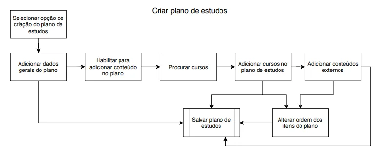
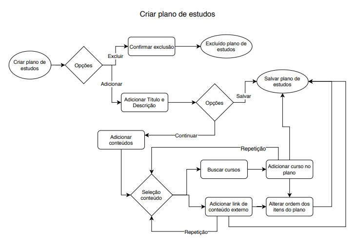
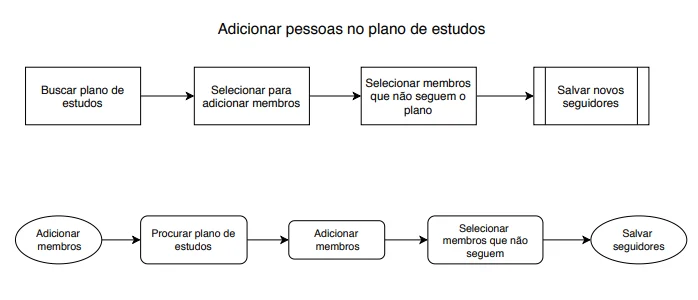
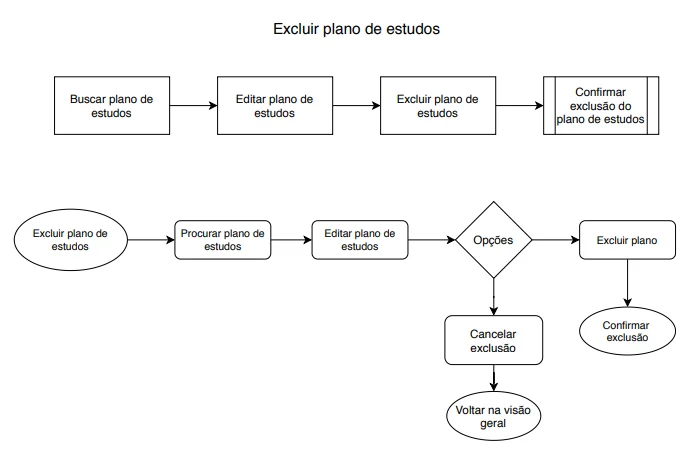

# Contexto de tareafas

 

## Analisando as tarefas

Agora que já fizemos uma análise, já escolhemos os concorrentes, fizemos uma análise em relação ao fluxo e o processo que eles têm para criar um plano de estudos, o que podemos observar dessas informações?

Nós tiramos prints, também. É importante lembrar que, como vários desses serviços disponibilizam apenas um período de avaliação, é importante tirarmos prints e até gravar as interações que vamos realizar nesses concorrentes.

O que nós podemos pegar de informações com esses dados que colhemos? Podemos, por exemplo, pegar as interações de tela que cada um deles utiliza, as animações, os padrões dos nossos concorrentes da interface e qual o fluxo de navegação que eles têm atualmente.

Mas se nós formos pegar todas essas informações e analisar com detalhes cada uma delas, o que vai acontecer? Vamos estar copiando o nosso concorrente, e não é isso que queremos, nós só queremos ideias de como melhorar o nosso fluxo. Então o que vamos fazer? Nós não vamos focar com detalhes em cada uma das telas, nós vamos abstrair as informações que nós coletamos dos nossos concorrentes.

Por isso que é interessante vocês gravarem todas essas informações, porque elas podem ser muito úteis no futuro. Mas não é que vamos jogar tudo fora, vamos utilizar outro processo, que é o que chamamos de descrição das tarefas.

Tarefas, na parte de experiência do usuário, é o que temos que fazer. Nós começamos com um objetivo e até alcançar esse objetivo, todos os passos seriam o que faz parte dessa tarefa. Nós vamos utilizar uma descrição de tarefas para descrever como os nossos concorrentes criam um plano de estudos. O processo deles.

Antes de chegar no nosso concorrente, eu vou mostrar para vocês como criar a descrição de tarefas com a MusicDot. Eu vou utilizar para isso, uma ferramenta que chama Draw.io, vou apresentá-la para vocês. Vou colocar no navegador “draw.io”.

É uma ferramenta gratuita, que você pode utilizá-la tanto no navegador online, quanto uma aplicação desktop. Quando eu digito o endereço no navegador, aparece uma janela com duas opções para eu selecionar: ou eu crio um novo diagrama ou eu abro um existente. No caso, eu vou criar um novo diagrama, então “Create New Diagram”.

Aqui aparece, nessa segunda tela, várias opções de diagramas, templates prontos de outros tipos de diagrama, por exemplo, UML, tabelas. Mas o que queremos fazer nesse momento é um diagrama mais simples e em branco. Eu não vou utilizar nenhum template. Então eu vou selecionar a primeira opção, “Basic”, “Blank Diagram” - diagrama em branco.

Antes de abrir eu vou colocar um nome: “tarefa-plano_de_estudos-musicdot”. É importante para ficar mais fácil eu encontrá-la depois. Daí eu vou vir na última opção, “Create”. Ele vai abrir uma tela em branco.

Aqui ele abre uma tela quadriculada para ficar mais fácil de manipular as formas geométricas que eu tenho e todas aquelas opções que tinham antes, também aparecem aqui.

O flow, aqui tem algumas setas que eu posso selecionar e utilizar. E eu posso também carregar os outros templates, outras formas que a ferramenta tem disponível.

Nessa opção, no “File”, “Page Setup”, aqui ele fala qual é o tamanho dessa minha área de informação. Aqui está selecionado A4, eu posso deixá-la em pé, “Portrait”, ou como se fosse uma folha deitada, “Landscape”. Eu vou deixá-la de pé mesmo por enquanto, “Apply”. E aqui eu vou utilizar toda a minha área.

Ela é uma ferramenta online. Eu estou utilizando a tecla “Ctrl” e o scroll do mouse para aumentar e diminuir o zoom.

Eu vou vir aqui e selecionar um retângulo. Aqui não apareceu. Dependendo de como você abrir, ele pode já abrir uma tela de formatação. Eu vou já abri-lo agora, nessa opção “View”, “Format Panel”. Caso ele não venha aberto, você pode abrir dessa maneira.

E aqui tem algumas opções de configuração, por exemplo, se eu selecionar a forma, eu posso mudar o estilo dela, a cor, o tamanho do meu texto, a formatação do texto e o posicionamento dela na minha tela.

Quando eu estou com a minha forma selecionada, aparece esse semicírculo que eu posso mudar a rotação da minha forma ou eu posso vir em uma das setas e criar uma cópia da minha forma.

Se eu selecionar a seta, ele já cria automaticamente a nova forma igual a primeira que estava selecionada. Com a tecla “Delete” eu posso deletar, ou eu venho aqui, com botão direito do mouse, “Delete”.

Vou começar a criar o meu diagrama. Para eu adicionar um texto, dois cliques, ele abre para eu adicionar um texto dentro do meu retângulo. E agora eu vou começar o meu diagrama. Por onde eu começo? Eu tenho que mostrar a tela para vocês de onde começa! Então vamos aqui.

Essa é a primeira tela, vocês estão vendo só uma parte dela, mas para eu criar um novo plano de estudos, eu tenho que vir na minha opção “Criar novo plano de estudo”. Então a primeira coisa que eu vou fazer nos meus passos é selecionar essa opção.

Para o diagrama de tarefa – deixe-me aumentar o zoom – eu não vou colocar exatamente o texto do meu botão, por quê? O que importa é eu selecionar uma opção para entrar na criação do plano de estudos. Não me importa tanto exatamente o nome do meu botão, porque ele pode mudar no futuro.

Então eu vou colocar aqui: “Selecionar opção de criação do plano”. Isso fica uma informação genérica o suficiente, que para começar a criar o meu processo do plano de estudos, eu tenho que selecionar alguma opção, independente do nome que ela tenha.

Aqui eu vou vir e já criar a minha próxima forma. Selecionei a seta. Como ele cria uma cópia, ele já colocou também o texto. Não tem problema, eu dou dois cliques, ele seleciona todo o texto que já estava cópia do anterior e eu aperto a tecla “Delete”.

Aqui, agora eu vou para a minha segunda fase do meu processo de criação. Quando eu aperto aquela seleção para criar plano de estudos, ele vem para essa tela.

Essa tela, inicialmente, não tem nenhuma informação sobre o que é obrigatório, mas se eu não digito nada e aperto o botão “Salvar plano”, ele vai falar para mim que pelo menos o título do plano é obrigatório de ser colocado.

Eu posso ou não colocar a descrição, e posso ou não adicionar um conteúdo do meu plano de estudos, porque eu posso criar o plano e depois adicionar informações. Esse é o processo.

Por enquanto nós apenas estamos descrevendo como é o processo atual, ainda não estamos avaliando e julgando nada. Então eu vou vir aqui - eu posso colocar essas informações gerais. Eu vou vir aqui: “Adicionar informações gerais do plano”.

Aqui eu também não vou colocar exatamente que eu tenho que pôr o título, que eu tenho que descrever, principalmente porque a descrição do meu plano é opcional. Porque eu posso, no futuro, adicionar mais informações e isso não vai impactar tanto no meu plano de estudos.

Eu sei que eu tenho que adicionar essas informações, independente de quais sejam. Por isso que eu não vou descrever cada um dos campos nessa parte. Eu coloquei como “informações gerais”.

Depois dissom eu posso vir e salvar o meu plano de estudos. Venho na opção: “Salvar plano”. Nesse caso, como é a última opção do meu plano e vai ser um processo que o meu sistema vai salvar, gravar no banco de dados, enfim, toda aquela parte de sistema.

Eu estou optando por colocar uma forma aqui de finalização do meu fluxo. Só para ter certeza de onde ele começa - porque tem o início das setas - e onde ele vai terminar.

Então aqui eu coloquei a forma e – acho que eu fiz rápido, deixe-me fazer de novo – eu selecionei esse retângulo, e eu vim na setas e coloquei do meu retângulo anterior para esse, ligando com esses pontos.

Eu posso também não ligar com esses pontos, criar aqui no meio, mas quando eu coloco no ponto, fica mais fácil se eu, por exemplo, movimentar, a minha seta também vai junto. Ela não vai quebrar e eu tenho que mexer menos nessa parte de formatação. Então é mais fácil vocês conectarem de um ponto do retângulo para o outro.

E aqui então, vai ser a finalização do processo, eu vou colocar: “Salvar plano de estudos”. Então quando eu vou criar um novo plano de estudos, esse é o processo inicial na plataforma da MusicDot.

Aqui eu vou colocar também. Tem aqui uma caixa de texto, eu vou colocar aqui em cima. Dois cliques, “Criar plano de estudos”, porque daí, eu sei o que significa todo esse meu fluxo. Seleciono, vou aumentar minha caixa.

Se eu selecionar esse traço laranja que aparece significa que é o meio da minha folha, então eu posso, por exemplo, vir aqui e colocar o meu fluxo no meio da minha folha. Então aqui eu tenho o meu primeiro diagrama no meio da minha folha.

Eu já tinha criado anteriormente todos os fluxos relacionados ao plano de estudos, então eu vou apresentar para vocês. Todas as imagens da plataforma da MusicDot e esses fluxos que eu criei vão estar disponíveis para vocês fazerem download. Esse é o fluxo completo da criação do plano de estudos e eu vou explicar para vocês cada um dos detalhes.

Aqui eu tenho aquela opção de selecionar a opção de criação do plano de estudos, adicionar dados gerais do plano e a opção para salvar, que é esse primeiro fluxo que tínhamos criado.

Além dele, se eu vier na tela, eu posso habilitar para adicionar o conteúdo do meu plano. Então eu venho aqui para habilitar o conteúdo, e daí sim eu posso adicionar o conteúdo do plano de estudos.

Vou procurar os cursos, eu adiciono cursos no meu plano de estudos e já posso vir salvar ou eu posso também adicionar o conteúdo externo, e seguindo esse outro fluxo por fora, posso já salvar direto, ou eu posso vir no alterar a ordem dos itens.

Então conforme eu for adicionando, eu posso alterá-lo para o segundo, porque ele sempre vai adicionando no primeiro lugar, todos os itens que eu vou adicionando no plano. Então aqui eu posso alterar a ordem, e por último, salvar o meu plano de estudos. Esse é o fluxo completo do plano de estudos.

Além desse fluxo, eu também criei aqui embaixo o “Adicionar pessoas para seguir o plano de estudos”. Se eu observar nessa tela, aqui não tem nenhuma informação para adicionar as pessoas para seguir e no meu fluxo também não. Ele é uma tela separada.

Quando eu vou procurar o meu plano de estudos depois que eu o crio, aparece um retângulo e aqui tem a opção para adicionar membros. Então como funciona o fluxo para adicionar pessoas no plano de estudos?

Eu venho nessa opção “Buscar plano de estudos”, depois eu tenho “Selecionar para adicionar membros”, que é essa opção da tela. Então eu procurei, depois eu adicionei o membro. E tem a opção “Selecionar membros que não seguem o plano”, que é essa tela aqui.

Aqui eu tenho apenas a listagem das pessoas que não seguem o plano de estudos, então eu posso adicionar todos de uma vez ou ir selecionando de um em um. E salvo os novos seguidores do plano.

Além desse fluxo, também tem o fluxo de “Excluir plano de estudos”. Se eu mostrar para vocês, na mesma tela de criação eu tenho essa opção de excluir plano, que é acessada tanto quando eu estou adicionando, quanto se eu vier no “Editar” e ele cai naquela tela do meu plano. Deixe-me voltar aqui. Então ele cai nessa tela, tanto no editar, quanto no criar. E aqui tem a opção de excluir.

Como funciona a descrição dos passos dessa tarefa de excluir o plano estudos? Eu busco o plano de estudos que eu quero excluir e vou na opção “Editar”. Depois eu vou na opção “Excluir plano de estudos” e eu vou confirmar a exclusão do plano de estudos, e o sistema vai excluir.

Aqui tem os três diagramas dos processos relacionados ao plano de estudos. Tem a criação, adicionar pessoas e o exclusão. Eu não coloquei a edição porque ela é bem parecida com a criação. Eu posso alterar todas as informações do meu plano de estudos, por isso que aqui eu não adicionei um fluxo separado.

E agora vamos trabalhar em cima dessas informações. Vamos lá?

### Criar Plano de estudos

 

 

### Criar Plano de estudos #2

 

 

### Adicionar pessoas no plano de estudo

 

 

### Excluir plano de estudo

 

 

## Preparando o ambiente

Disponibilizamos o download dos arquivos:
- Diagrama de tarefas e do fluxo de tarefas da Musicdot [no arquivo do draw.io](https://caelum-online-public.s3.amazonaws.com/1338-ux-research-analise-concorrentes/MusicDot-fluxos-antigos.drawio) e no [arquivo pdf](https://caelum-online-public.s3.amazonaws.com/1338-ux-research-analise-concorrentes/MusicDot-fluxos-antigos.pdf)
- Diagramas de um dos concorrentes indiretos da MusicDot [no arquivo do draw.io](https://caelum-online-public.s3.amazonaws.com/1338-ux-research-analise-concorrentes/iEstudos-fluxos.drawio) e no [arquivo pdf](https://caelum-online-public.s3.amazonaws.com/1338-ux-research-analise-concorrentes/iEstudos-fluxos.pdf). 

Você pode acompanhar os vídeos e as explicações diretamente com os arquivos.

 

## Fluxo de navegação

Agora nós já terminamos de fazer os fluxos da MusicDot. Vamos trabalhar com os fluxos dos nossos concorrentes indiretos.

Eu já criei o fluxo do plano de estudos de um deles, que é do iEstudos. Se eu vier nessas setinhas laterais, eu consigo expandir e aqui nós vemos o nome do nosso diagrama. Aqui eu tenho dois diagramas, um do processo de “Criar plano de estudos” e o de “Registrar estudos de um dia”.

Eu vou dar um zoom e eu vou passar aqui no fluxo do “Criar plano de estudos”. Lembrando que esses diagramas já vão estar disponíveis para vocês, se quiserem fazer download e acompanhar comigo no computador, vocês podem fazer. Aqui eu dei um zoom, então vamos lá!

O processo do plano de estudos no concorrente começa com colocar os dados gerais com a data final da prova. Eu coloquei um “*” aqui que é a parte mais importante. Depois eu vou selecionar matérias e parâmetros.

Aqui, eu coloquei como destaque importância e dificuldade, que não importa exatamente como eu vou selecionar, mas são dois parâmetros importantes nesse fluxo.

Depois ele coloca para selecionar o tempo de estudos, que pode ser dado tanto como diário ou dias úteis e final de semana. E depois ele pede para selecionar o tipo de grade de estudos.

E eu coloquei as opções que ele tem disponível, “Fixo/N matérias por dia/Livre”. Depois ele pede para selecionar o tempo de dedicação por matéria, e ele gera o plano de estudos baseado em tudo isso.

Algumas das telas, eu tinha apresentado para vocês e eu tenho aqui uma dessas telas. Deixe-me dar um zoom. Essa tela corresponde a esse passo de selecionar o tipo de grade de estudo. Eu tenho aqui as opções “Ciclo fixo”, “N matérias/Livre”, que eu coloquei que seria “Não criar grade”.

Mas para cada uma dessas opções vão aparecer outras situações aqui embaixo, para o usuário selecionar como ficaria a grade de estudos. No ciclo “fixo” aparecem outras informações e no “N matérias” aparecem outras informações, essa grade vai mudando.

Mas isso não fica claro nesse diagrama de tarefas. Essas situações que o usuário tem que escolher entre as opções não fica claro. O que seria ideal? Que criássemos algum fluxo que mostrasse quais os processos de decisão que o usuário vai ter que realizar.

Nesse diagrama não é como fazemos isso, mas podemos criar outro, chamado fluxo de tarefas. Ou vocês podem achar materiais também em inglês, como o Task Flow. Eu vou mostrar e eu vou criar para a MusicDot.

Eu vou ouvir aqui, esse era aquele inicial que estávamos fazendo em relação ao “Criar o plano de estudos”, e eu vou criar esse do fluxo logo aqui embaixo. Deixe-me fechar essa aqui.

Como primeira opção – deixe-me abrir a tela para vocês – tem o “Criar novo plano de estudo”. Eu vou vir aqui, para mostrar que eu estou iniciando o meu processo, eu vou usar essa elipse. Dou dois cliques e vou colocar o conteúdo: “Criar plano de estudos”.

Depois desse passo, eu vou selecionar esse de cantos arredondados só para ficar diferente do fluxo de tarefas, para poder diferenciar um do outro. Daqui eu venho para cá, vou conectar aqui no ponto. Depois desse passo ele vai abrir essa tela.

Aqui eu tenho duas opções: o “Excluir plano” e “Salvar plano” - e para eu salvar eu tenho que adicionar essas informações. Aqui eu tenho só a opção de “Adicionar informações gerais do plano de estudos”.

Nesse caso, como o processo era só da criação do plano de estudos, eu não coloquei a opção de excluir, mas ela faz parte da nossa tela. Assim que entramos, ela faz parte do processo de decisão do usuário. Então eu vou adicioná-la aqui também. Ao invés de colocar essa forma, eu vou colocar o losango.

Vocês viram que eu troquei a forma sem precisar deletar a seta. A Draw.io tem essa opção. Eu tenho só que gerar aquele sinal, então se eu jogar no meio ele troca. Também eu posso vir simplesmente, tirar a seta, deletar e colocar a nova.

Aqui eu vou utilizar o losango para ser a forma para apresentar o processo de decisão. Daqui do plano eu vou colocar uma seta.

Aqui eu tenho duas situações, e vou pegar aqui duas formas. Aqui a tela! Então ou eu venho para o “Excluir plano” – deixe-me diminuir aqui – e eu finalizo com o processo de exclusão. Então aqui vou colocar: “Excluir plano” e aqui eu confirmo: “Confirmar exclusão”, e eu vou colocar uma seta vindo para cá, ou é o restante do fluxo. Vou adicionar.

Vou até pegar aqui a informações gerais. Vou pegar mais um texto, colocar aqui e depois eu posso: “Salvar plano”. Vou ligar uma seta com a outra. Aqui, para não ficar vazio, eu vou colocar assim: “Selecionar opções”.

Se eu der dois cliques aqui, eu posso adicionar um texto, posso colocar aqui “Excluir”, e aqui eu posso colocar “Adicionar”. E aqui eu coloquei a forma final no meu processo.

Esse não é todo o processo que eu já tinha mostrado para vocês, mas se eu fosse só representar essa parte, esse seria o meu processo de decisão só dessa primeira parte do fluxo.

Aqui ele seleciona a opção e ele é encaminhado para o final do fluxo, dependendo do que ele selecionar. Eu vou mostrar para vocês agora como ficaria aquele fluxo completo da MusicDot. Eu já tinha feito anteriormente.

Aqui eu tenho todo aquele processo das tarefas que eu tinha apresentado e aqui embaixo está todo o fluxo. Eu vou, junto com vocês, mostrando como funciona na MusicDot, cada um dos processos.

Aqui é igual ao que tínhamos criado, só os textos estão diferentes, mas a ideia é a mesma. E quando ele chega na opção de salvar, ao invés de colocar o adicionar e vir direto para o salvar, ele tem duas opções, se eu vier na tela.

Aqui ele pode tanto salvar já direto, como a opção que tínhamos colocado anteriormente, ou ele pode vir e adicionar um conteúdo para o plano de estudos. Eu vim aqui, coloquei esse losango para ele decidir se ele quer continuar o processo ou se ele já quer salvar o plano de estudos.

Continuando o plano, vou dar um zoom. Habilitei para adicionar os conteúdos no meu plano. Na seleção de conteúdos tem um processo de decisão, ou eu adiciono os cursos da MusicDot ou eu adiciono um conteúdo externo. Desses conteúdos, eu posso voltar para cá e selecionar outro conteúdo ou outro curso, e a mesma coisa para o externo. Tem um fluxo aqui voltando.

Depois que eu adicionei o conteúdo, eu posso alterar a ordem desse conteúdo e depois ele me encaminha para a opção final de salvar o plano. Aqui também, como não é obrigatório alterar a ordem dos itens no meu plano, depois de adicionar um curso da MusicDot ou um conteúdo externo, eu posso vir direto para a opção de salvar o meu plano de estudos. E esse fluxo corresponde a esse diagrama de tarefas.

Eu fiz do mesmo jeito que eu fiz para o plano, eu criei a opção para adicionar pessoas baseado naquele fluxo anterior. Eu coloquei lado a lado, só para explicar como eu fiz isso: se eu estou na primeira página e vier aqui, ele cria automaticamente novas páginas, para não ficar a forma jogada na ferramenta.

Eu só coloquei aqui para o lado. Aqui eu coloquei adicionar pessoas, mesma coisa: “Adicionar membros”, “Procurar plano de estudos”, “Adicionar membros”, “Selecionar membros que não seguem” e “Salvar seguidores”. Aqui não tem nada em relação ao processo de decisão, ele é bem linear mesmo.

Já no “Excluir plano de estudos”, eu coloquei aqui um processo de seleção. Ou eu posso excluir o plano e o meu sistema confirma a exclusão, ou eu cancelo a exclusão e volto para a visão geral, com todos os planos existentes.

No “Excluir plano de estudos”, se viermos aqui - eu tinha falado anteriormente que eu tenho que vir nessa tela do editar, seleciono essa opção: “Excluir plano”. Por isso tem o procurar plano e depois eu entro na opção de editar, daí tem as opções de excluir.

Esse é o fluxo da MusicDot. A ideia agora é também fazer, do mesmo jeito que fizemos para a MusicDot, para os nossos concorrentes.

 

## Fluxo do concorrente

Então, agora nós já criamos os nossos fluxos da MusicDot, e eu criei anteriormente os fluxos de criação de plano de estudos e de registro diário de estudos de um dos nossos concorrentes, que é do iEstudos. Eu vou mostrar para vocês como ficou esse fluxo.

Aqui tem o diagrama para criar o plano de estudos, que eu já tinha mostrado para vocês, e aqui é o fluxo de decisão daquela tarefa. Eu vou mostrando por partes como ficou.

Tem aqui o “Criar plano de estudos”, e eu coloco o nome do plano. Aqui tem um processo de decisão em relação à data da prova, ou eu coloco um dia específico ou ele coloca automaticamente para daqui a 6 meses.

Aqui vocês podem perguntar: “Mas por que eu coloquei o nome do plano de estudo aqui e não coloquei uma informação genérica?” Porque por enquanto, o meu concorrente só disponibiliza essa opção. Como não é o nosso sistema e eu estou querendo gravar exatamente como ocorre hoje esse processo de decisão, nesse caso eu coloquei exatamente o campo.

Depois desse processo de decisão, com a data da prova, eu vou colocar o conteúdo do meu plano. Aqui eu tenho um fluxo de repetição, então até terminar de selecionar todas as matérias que eu quiser para o meu fluxo, eu seleciono o nome da matéria, coloco a importância e a dificuldade para aquela matéria.

Vocês reparem que aqui eu só coloquei as informações que eu posso selecionar e alterar, eu não coloquei exatamente como eu faço isso. Então aqui ele fica nesse fluxo até terminar de selecionar todas as matérias.

Aqui eu coloquei uma informação de “Não”, aqui eu coloquei “Sim”. Ou eu posso colocar, por exemplo: “Repetição”. Quando eu sair, eu venho aqui para colocar o tempo da minha grade de estudos.

Eu coloco aqui exatamente dois tipos de tempo. O primeiro é em relação ao início dos estudos, que pode ser ou hoje ou amanhã, e em relação ao término dos estudos. Os dois vão ter influência em relação ao tempo de dedicação.

Para o início, eu posso colocar essas duas opções e para o término eu tenho essas três opções, um dia antes, uma semana antes ou dois dias antes. Aqui ele vai apresentar em relação à data que eu tinha selecionado anteriormente.

Depois de colocado o tempo total que eu tenho, eu vou selecionar o meu tempo de dedicação de estudos. Essa seleção do meu tempo de estudos, se dá de duas maneiras: ou eu todos os dias da semana, um tempo individual para cada um, ou eu coloco o dia da semana e sábado e domingo. Tempo geral para os dias úteis e um para o sábado e um para o domingo.

Depois desse processo eu vou para a montagem da minha grade de estudos. Aqui eu vou selecionar o meu tipo de grade. Eu tenho aqueles três tipos, que são uma das telas que eu já tinha apresentado para vocês, ou eu coloco não criar grade, ciclo fixo ou duas matérias.

Nessa, se eu viesse no ciclo fixo, eu ordeno as matérias conforme eu quiser e coloco o tempo de estudos por matéria, também é uma opção que eu posso alterar.

Aqui tem uma seta para cima e para baixo, eu coloquei para ficar mais fácil de entender que uma não é obrigatoriamente depois da outra. Eu posso colocar um tempo, alterar a ordem e vice-versa.

Na opção “Não criar grade”, ele já vai direto para a opção de salvar plano de estudos. Na opção “Nº de matérias por dia”, eu só tenho a opção “Ordenar o plano de estudos” e depois vir para a opção “Salvar plano de estudos”.

Então, esse é meu fluxo completo do meu concorrente indireto para criar o plano de estudos dele. Vocês podem perceber que ele ficou bem mais detalhado do que simplesmente o meu diagrama de tarefas.

Agora, eu também tinha feito o registro do diagrama de tarefa para registrar um estudo de um dia. Aqui eu tenho “Selecionar data do estudo– Data máxima – hoje”, “Colocar o tempo de estudo do dia – Manual ou cronômetro”.

Porque pode ser tanto manual ou cronômetro. “Selecionar o tipo de estudo”, “Adicionar anotações do estudo” e eu salvo o registro. E aqui eu coloquei o fluxo de opções que eu tenho para o registro diário.

Eu tenho aqui “Registro de estudo”. As “Anotações de estudos” podem ser do dia de hoje ou de algum dia anterior. Depois eu seleciono a matéria que eu vou fazer o registro e tem diferentes modos de registros, que eu coloquei o cronômetro ou manual.

Para o cronômetro, ele tem a opção de avisar de tempo restante, então até acabar o tempo ele pode me dar esse aviso. E venho para o conteúdo.

O modo manual tem a opção do tipo de estudo, eu posso selecionar entre questões, “Teoria” e “Revisão”. Nas questões eu adiciono quantidade de questões feitas e a quantidade de questões certas.

E tem a última parte, que é a colocação do conteúdo estudado. De teoria e revisão eu simplesmente seleciono essa opção, ele não tem outras opções. Ele vai direto para colocar a parte de conteúdo.

Eu também posso dividir entre vários tipos, então eu coloco o tempo planejado, seleciono os diferentes tipos de opção para cada um dos tempos planejados e eu distribuo esse tempo entre questões, teoria e revisão. Então o tempo que eu tinha planejado eu vou distribuir entre essas três opções. E eu salvo o meu plano.

Nessa opção, vocês podem ver que eu não tenho mais nenhum outro tipo de informação, eu só adiciono realmente o tempo. Não tenho para adicionar conteúdo nem nenhuma outra anotação. Então, esse é o meu fluxo detalhado para registrar os estudos de um dia do meu concorrente.

A ideia é que para cada um dos concorrentes nós façamos esse fluxo detalhado, porque assim, nós entendemos como os concorrentes estão realizando aquela funcionalidade e conseguimos ter as ideias, sem nos basear exatamente nas telas do nosso concorrente.

Então aqui temos uma ideia geral do processo deles.