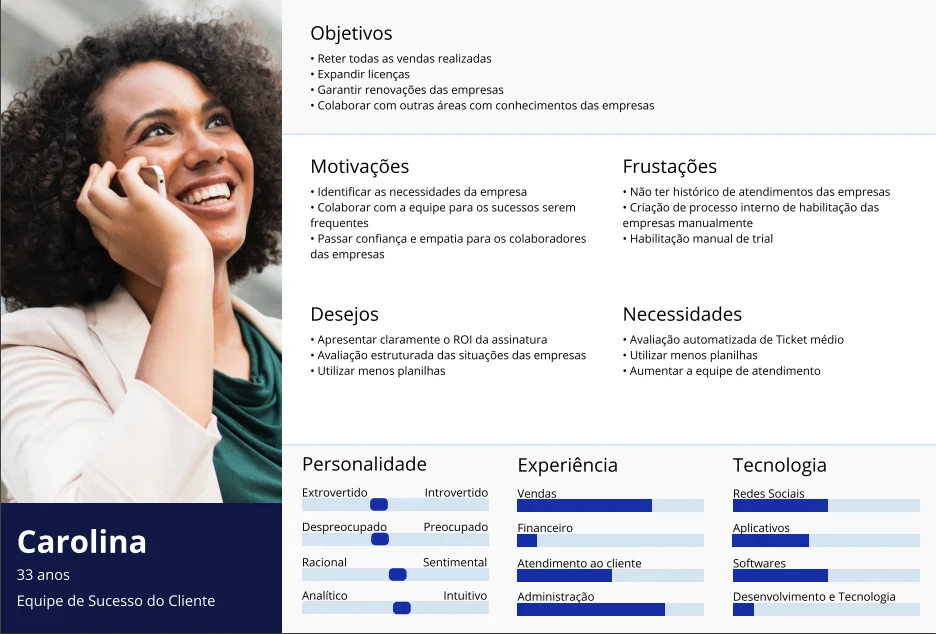
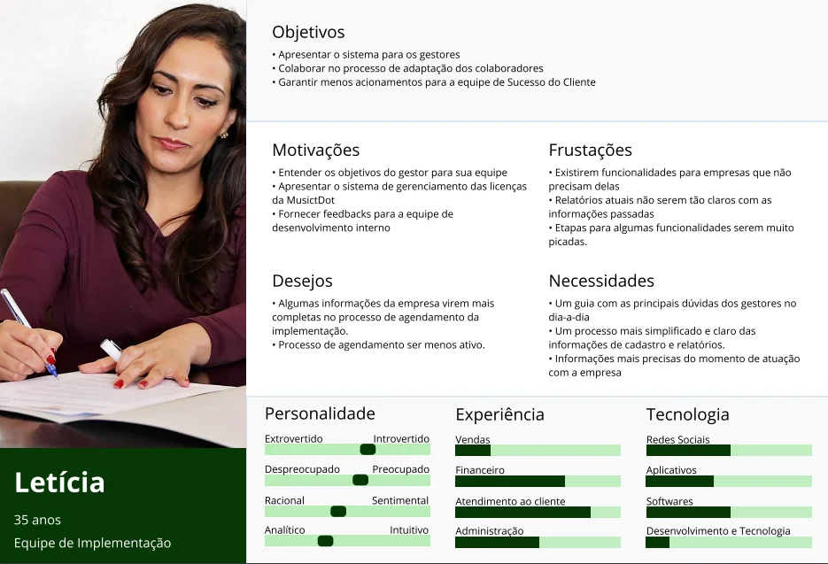
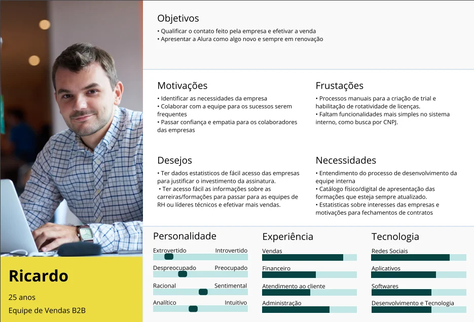
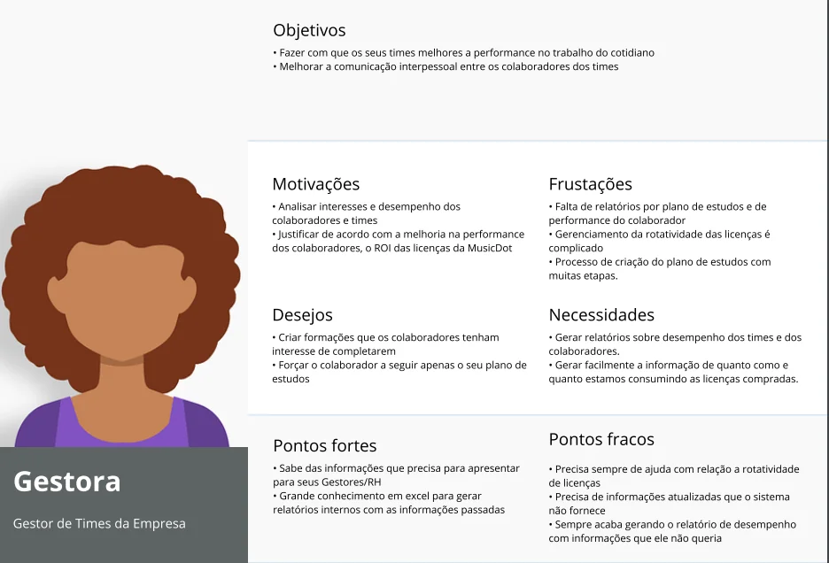

# Realizando as entrevistas

 

## Conduzindo entrevistas

Nesse estudo daremos algumas dicas para iniciar a conversa e deixar a pessoa mais confortável no começo da entrevista. A primeira delas é avisar para a pessoa que ela não será identificada nas respostas quando passarmos os resultados adiante. Isso é importante para que ela não tenha medo de dar resposta sinceras. Afinal, caso ela fosse identificada, ela poderia eventualmente ser repreendida por algum superior pelas informações que fossem pasadas, e queremos que ela se sinta segura.

Outra dica é explicar os motivos da realização da pesquisa. Isso é importante para que a pessoa entenda o objetivo das perguntas, por que ela foi escolhida e por que as informações que ela tem são tão importantes. No nosso caso, como estamos entrevistando pessoas internas da MusicDot, também podemos informar que, caso elas se lembrem de algo importante ou muito específico no futuro, elas poderão nos procurar. Isso ajuda na fluidez da entrevista, evitando que a pessoa trave se esforçando para lembrar de algo.

Antes das entrevistas, é importante pensarmos na estrutura, deixando disponível um gravador, celular ou mesmo notebook para gravar/filmar as entrevistas. Assim, não precisaremos perder tempo em anotar tudo que a pessoa fala e poderemos prestar mais atenção às suas respostas. Note que, antes de realizar uma gravação, é preciso ter a confirmação de que a pessoa permite isso, por exemplo assinando um termo. Também é ideal que conste nesse termo que as informações ou a entrevista dada pelo entrevistado não serão passadas para outras pessoas. Caso a pessoa não permita que a entrevista seja gravada, em hipótese alguma devemos fazê-lo, e nesse caso deveremos registrar as respostas em papel e caneta.

 

## Entrevistas B2B

### Vendas
- Tem interação apenas inicial com as empresas
- Entendem a necessidade e enviam a proposta para a empresa, de acordo com as
suas necessidades
- A questão de vendas de licenças fixas ou rotativas varia de acordo com a verba
disponível da empresa.
- Pequenas empresas pedem mais desconto e fecham mais rápido
- Empresas grandes tem mais interesse em relatórios para justificar o investimentos
nos cursos.
- Empresas pequenas não enfatizam tanto o relatório ou não veem tanta necessidade.

 

**Problemas com o sistema atual**
- Dois itens enfatizados pela equipe que eles precisam é um processo de trial mais fácil e habilitar a rotatividade para a empresa mais fácil também.
- Sentem falta de feedback da área de desenvolvimento para as suas demandas. Por conta disso, eles acabam não pedindo para realizar algo, porque acham que a probabilidade de resolver isso, é pequena.
- Empresas pedem informações sobre quais os cursos atuais existem na plataforma. Antes existia um catálogo bonito com as informações, mas o catálogo ficou desatualizado. Hoje eles tem uma listagem simples com todos os cursos, quem são os instrutores, etc. As empresas usam essa listagem para justificar o investimento
nas licenças.

### Implementação

Após a liberação do link pela equipe de vendas para que eles preencham um formulário com informações básicas da empresa, existe o passo da implementação. Após o preenchimento do formulário, o cliente pode agendar um horário para realizar a apresentação do sistema.

No geral passa por todos os pontos dos gestores, dos relatórios até as funcionalidades. Pede para habilitar licenças, gerar um relatório de desempenho e um plano de estudos, adicionando colaboradores para eles. Basicamente é esse o fluxo de apresentação.

Principais dúvidas e dificuldades dos gestores no processo de implementação:
- “Cadastrei um colaborador, como faço para habilitar a licença para ele?”
- Os gestores ficam confusos com o processo de criação de um plano de estudos.
- “Criei um plano de estudos , como adiciono um aluno?” Atualmente são etapas
diferentes e os gestores têm muitas dificuldades com isso.
- “Como faço para um colaborador vê determinado plano de estudos?”

**Problemas do sistema**
- Gestor não consegue identificar facilmente se determinado colaborador está seguindo um plano de estudos ou não. Porque quando ele segue, o gestor não consegue encontrar o colaborador na listagem para adicionar.

Não possuem tanto interesse inicialmente no relatório de interesse e também não demonstram dúvidas.

As empresas que possuem rotatividade tem muito interesse em como funciona e como extrair relatórios sobre isso.

Opinião sobre os relatórios atualmente:
- Relatório de desempenho para alguns é muito difícil de entender, principalmente se
for mais completo.

 

### Sucesso do Cliente
A equipe de sucesso do cliente fica com a responsabilidade de realizar o onboarding com
os gestores, trabalhar o engajamento e ajudá-los nas demandas quando necessário.
O principal objetivo da área é reter todas as vendas e expandir nas renovações e novas
licenças.
Atividades da equipe:
- Ambas as equipes de atendimento possuem onboarding e a parte de engajamento,
com futura renovação.
- Para as empresas, após todo o processo com a equipe de vendas e financeiro é
possível agendar para realizar o onboarding com a equipe de implementação. A
equipe apresenta todas as funcionalidade e como realizar tudo no sistema dos
gestores.
- Grandes empresas fazem solicitações com mais frequência, mas ambas fazem no
geral.
As maiores demandas são:
- Nº de atividades realizadas e não apenas cursos concluídos

 

## [Exercício] Perguntas espontâneas

Foi realizado uma entrevista com a Luciana da equipe de sucesso do cliente.

Após o tempo eu faço uma pergunta sobre qual funcionalidade ela acha que poderia melhorar na plataforma. Baseado na resposta dela eu pergunto "Você acha que isso afetaria positivamente o seu trabalho?".

Existe um problema com essa questão, mas qual é esse problema?

- [x] A) A questão possui um viés em como a última questão em como ela foi apresentada, levando a colocar como positiva a resposta. 
    > O melhor seria apresentar a questão “Você achar que essas melhorias vão influenciar o seu trabalho? De que maneira?”

- [ ] B) A questão não parece ter um propósito direto na pesquisa, por não estar diretamente ligada aos propósitos e hipóteses da pesquisa. 
    > Na verdade a questão está relacionada porque com a questão podemos analisar como a entrevistada analisar as futuras mudanças da plataforma voltada para empresas. O problema é que a questão foi apresentada com um viés na pergunta.

- [ ] C) Não existe nenhum problema com a questão em como ela foi apresentada. 
    > Na verdade no modo como ela foi apresentada leva a afirmarmos que as melhorias que serão feitas no sistema vão influenciar positivamente o trabalho dela e apenas queremos que a entrevistada confirme.

- [ ] D) A questão não estava planejada no roteiro e por isso não deveria ser incluída na pesquisa. 
    > Não existe um problema em adicionar questões que são relevantes para a pesquisa. Mas deve-se tomar cuidado para não enviesar quando perguntamos para o entrevistado.

 

## Personas

Na pesquisa, realizamos a entrevista com seis pessoas ao todo: duas da equipe de vendas e quatro da equipe de sucesso do cliente. Para passarmos as informações para outras pessoas interessadas, as informações passadas foram transcritas. Isso facilita o processo, já que quem esiver interessado não precisará assistir às entrevistas por completo.

No texto, encontraremos vários itens que forma identificados a partir das falas dos entrevistados, lembrando que eles não estão identificados. Como temos uma grande diversidade de tópicos, seria difícil para outra pessoa saber quais informações são importantes. Poderíamos separar essas informações em outro arquivo de texto, mas existem jeitos melhores de as apresentarmos.

Um exemplo, que usaremos nesse curso, é a partir das **personas** - personagens fictícios criados a partir de dados coletados durante as entrevistas. As personas também nos ajudando eliminando a necessidade de identificarmos as pessoas e as informações que elas nos passaram, pois estas serão agrupadas nos personagens fictícios.

No nosso caso, as personas foram criadas para grupos de pessoas, começando pelo "Ricardo", uma persona criada apra o grupo de vendas. Apesar de termos realizado uma entrevista com a Talita, a equipe de vendas da MusicDot é composta em sua maior parte por homens, e por isso selecionamos uma persona masculina.

Criamos duas personas para a equipe de sucesso do clinte. A primeira, Carolina, faz os atendimentos no cotidiano, sanando as dúvidas das empresas. A Letícia, também dessa equipe, mas trabalha especificamente com a parte de implementação, apresentando a plataforma, seus recursos e funcionalidades logo após a contratação.

Nos nossos objetivos, definimos que precisamos saber quais são as dificuldades das empresas, e não exatamente das pessoas que essas personas representam. Sem obtermos dados diretamente das empresas, não poderemos criar uma persona que as representem, afinal só temos informações indiretas. Nesse caso, criaremos uma proto-persona, uma espécie de esboço de persona que possui todas as informações genéricas que obtemos indiretamente a partir das entrevistas.

### Proto-Persona #1

 

 

### Proto-Persona #2

 

 

### Proto-Persona #3

 

 

### Proto-Persona #4

 

 

Na construção das personas, incluímos os tópicos "objetivos", "frustações" (tanto em relação ao sistema administrativo quanto à plataforma B2B da MusicDot), "desejos" e "necessidades". Abaixo, colocamos as características de personalidade, experiência e o que ela conhece de tecnologia. Essas não são informações fixas, e podem ser modificadas livremente a depender da necessidade.

No caso da proto-persona, como não entrevistamos nenhum representante das empresas parceiras da MusicDot, não incluímos os traços de personalidade, experiência ou tecnologia, mas sim os "pontos fortes" e "pontos fracos" que a pessoa tem em relação à plataforma.